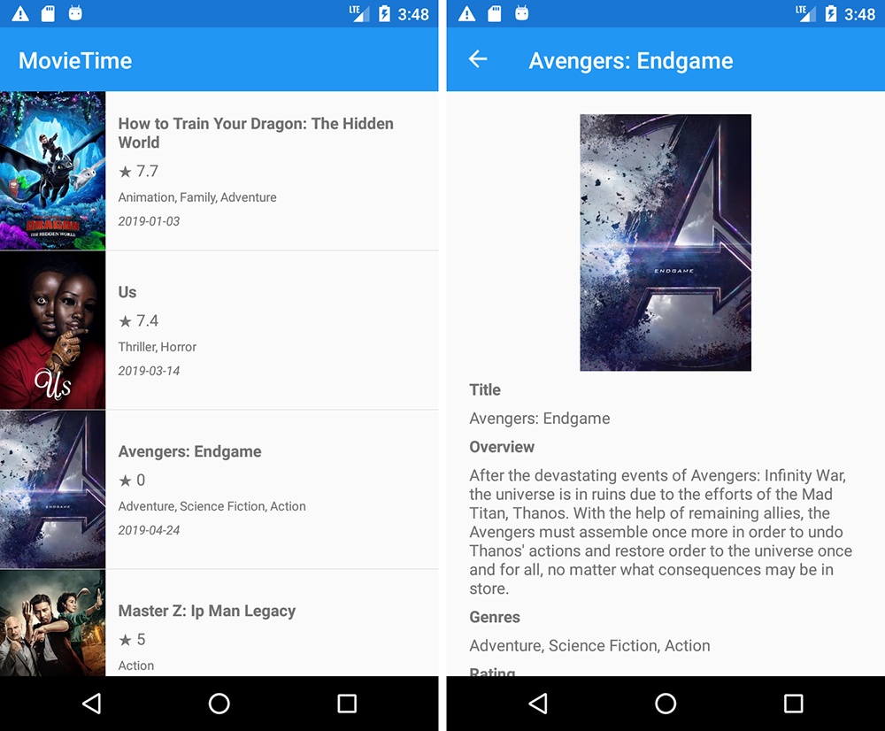

# MovieTime
A cross-platform upcoming movie titles explorer mobile app in Xamarin.Forms

## Screenshots

### Android

### iOS

## Dependencies

- **FreshMvvm**: due to simplicity and lightweight MVVM abstraction.
- **FFImageLoading**: library used to display poster images, chosen due to performance, simple way to fetch remote image (based on uri) and disk/memory cache capabilities.
- **Fody / Fody.PropertyChanged**: used to reduce code boilerplate, removing the necessity to manually invoke OnPropertyChanged and by these means, providing code clarity.
- **Refit**: picked based on the simplicity offered to create a Rest API client (KISS principle).
- **Xamarin.Forms.BehaviorsPack**: includes needed behaviors to implement infinite scroll list view in a MVVM manner (EventToCommandBehavior - ItemAppearing).

## Next steps

- Add App Center integration (Crashes/Exception logging)
- Add unit & UI tests
- Add movie search functionality
- Add network connectivity verification (Connectivity plugin)
- Add genre & movies repositories with caching to enable offline usage (Akavache)
- Add artifacts (custom logo) and styling
- Internationalization (i18n)